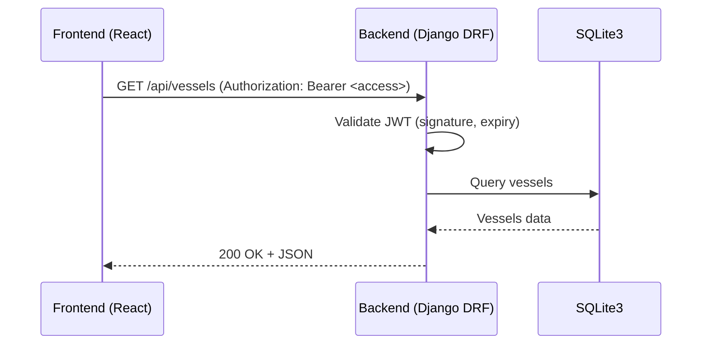
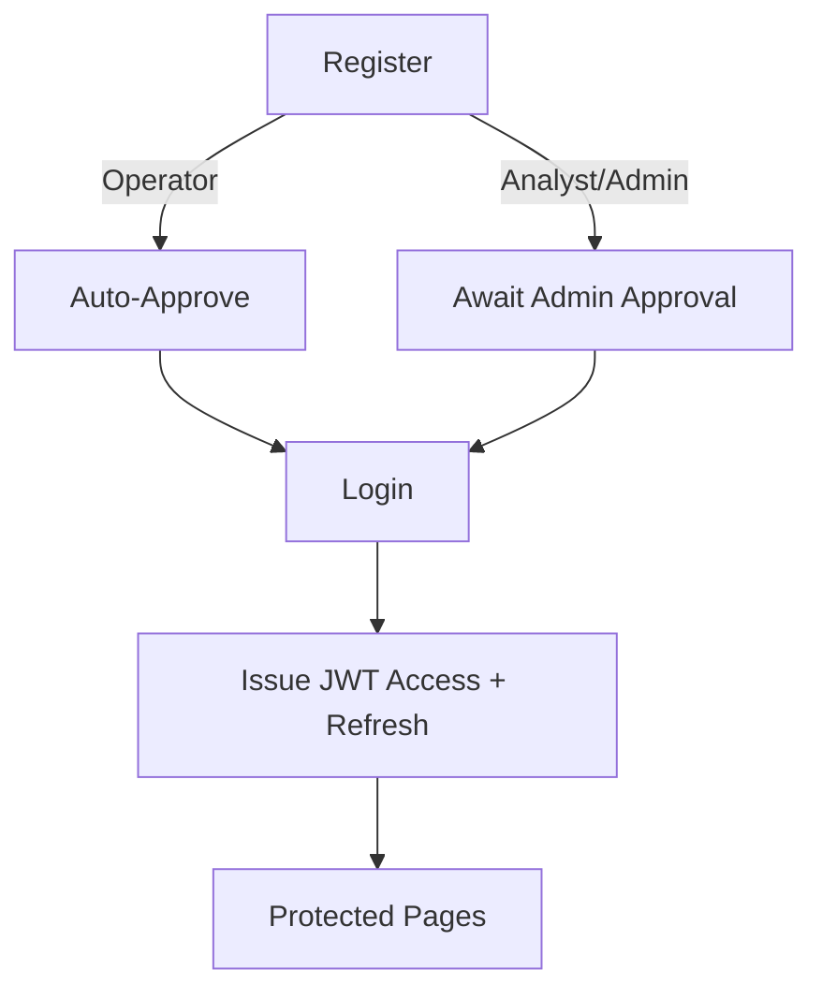
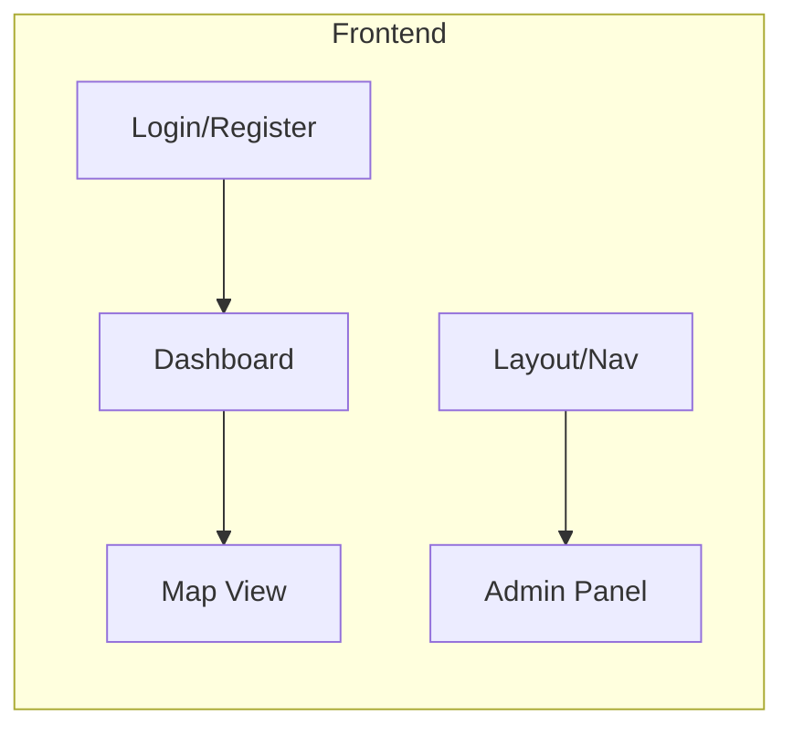
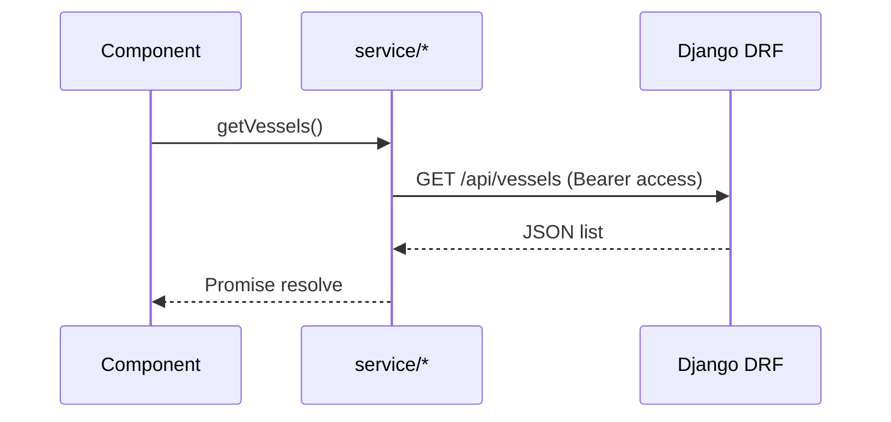
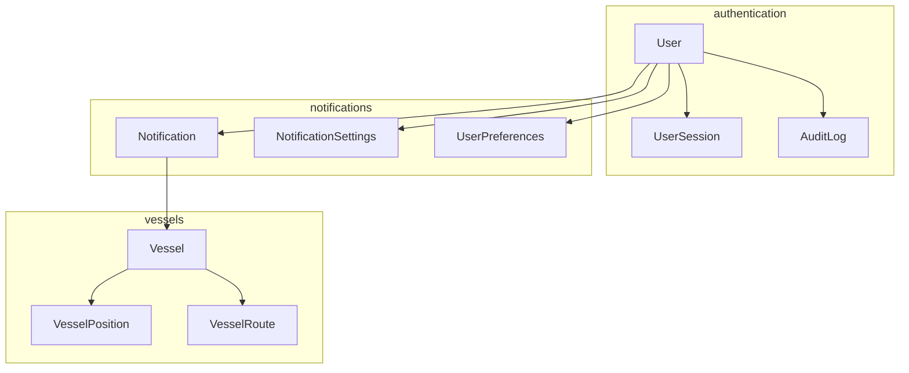
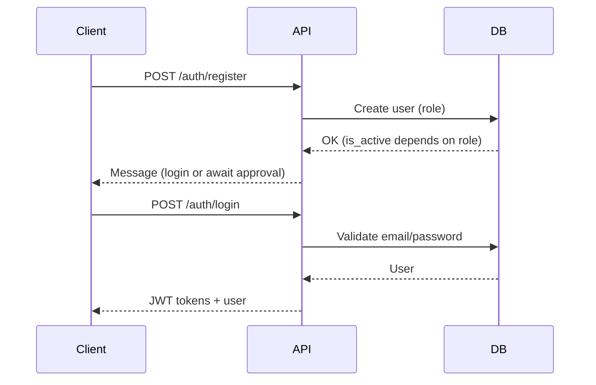
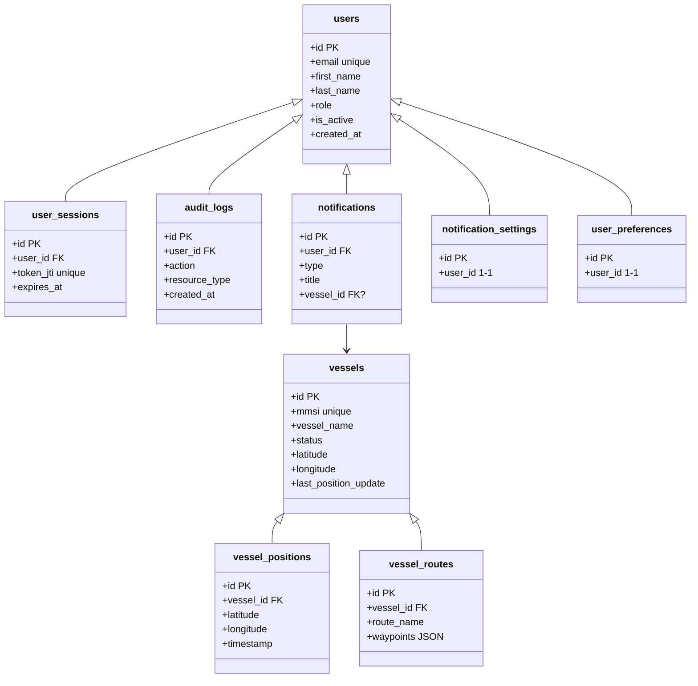
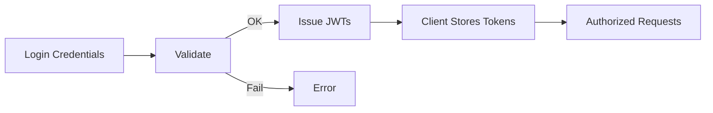

# Maritime Vessel Tracking, Port Analytics, and Safety Visualization Platform

Infosys Virtual Internship 6.0 — Final Project Documentation (Single File)

- Group: Sameera • Tharuni • Shweta
- Mentor: Aishwarya
- Date: 18 December 2025

---

## 1) Executive Summary

This platform enables maritime stakeholders to track vessels, analyze port activity, and visualize safety-related data. It provides secure login with JWT, role-based access (operator, analyst, admin), a React frontend for user interaction, a Django REST backend for APIs and processing, and SQLite3 as the database for persistence.

Key capabilities:
- User registration and approval workflow (operator auto-approved, analyst/admin need admin approval)
- Role-based UI and API access
- Vessel data management and historical position storage (voyage replay and analytics)
- Notifications and user preferences

---

## 2) System Overview

- Frontend: React + TypeScript (SPA), routing, protected pages, role-aware UI.
- Backend: Django + DRF, JWT auth, modular apps (`authentication`, `vessels`, `notifications`, `core`).
- Database: SQLite3 (dev) with tables for users, sessions, audit logs, vessels, positions, routes, notifications.

### 2.1 High-Level Architecture

```mermaid
flowchart LR
  A[Browser (React SPA)] -- JWT → B[REST API (Django DRF)]
  B -- ORM → C[(SQLite3 DB)]
  B -- Background configs → D[Celery/Cron (optional)]
  A -- Static Assets → E[NGINX (optional prod)]
```

### 2.2 End-to-End Request Flow (Protected Endpoint)



---

## 3) Authentication and Authorization (JWT)

- Stateless authentication with access + refresh tokens.
- Access token used on every API call via Authorization header.
- Refresh token can obtain a new access token when expired.
- Roles: `operator`, `analyst`, `admin` determine allowed actions.



---

## 4) Frontend (React + TypeScript)

### 4.1 Tech Stack
- React 19 + TypeScript
- Routing + ProtectedRoute
- LocalStorage for tokens
- Fetch/Axios with interceptors for Authorization header
- Leaflet for maps (Map view)

### 4.2 Key Pages and Components
- Auth pages: Login, Register (role-aware help texts)
- Dashboard: Role-specific summaries
- Admin Panel: User management, approvals, audit
- Map View: Displays database vessels on Leaflet map
- Layout: Role-based navigation (hide Analytics for operators)



### 4.3 Frontend Data Flow
- `services/api.ts`: Adds JWT to headers, handles 401 → refresh.
- `services/*`: Encapsulate API calls (auth, users, vessels).
- `useAuth` context: Holds current user and loading state.



### 4.4 Role-Based UI
- Operators: No Analytics link, limited actions.
- Analyst/Admin: Access to analytics and admin functions.

---

## 5) Backend (Django + DRF)

### 5.1 Apps Overview
- `authentication`: Custom `User`, sessions, audit logs, views, permissions.
- `vessels`: `Vessel`, `VesselPosition`, `VesselRoute`, CRUD and analytics endpoints.
- `notifications`: Notifications, settings, preferences.
- `core`: Base models (`TimeStampedModel`, `SoftDeleteModel`).



### 5.2 Key Backend Flows

- Registration: Operator auto-active; Analyst/Admin pending approval.
- Login: Validate credentials → issue JWT tokens.
- Protected endpoints: `IsAuthenticated` + role permissions.



---

## 6) Database (SQLite3)

This section details the schema derived from the Django models. Table names use `db_table` values where set.

### 6.1 Core Base Models
- `TimeStampedModel`: `created_at`, `updated_at` (abstract; included in child tables).
- `SoftDeleteModel`: `is_deleted`, `deleted_at` (abstract).

### 6.2 Authentication
- `users` (User)
  - email (unique, indexed), first_name, last_name, role (operator|analyst|admin, indexed)
  - is_active, is_staff, is_verified
  - security: failed_login_attempts, last_failed_login, account_locked_until, password_changed_at
  - profile: phone_number, organization, department, position, profile_picture
  - activity: last_login_ip, last_activity
  - timestamps: created_at, updated_at

- `user_sessions` (UserSession)
  - user_id (FK users), token_jti (unique, indexed), ip_address, user_agent
  - expires_at, is_active, created_at, updated_at

- `audit_logs` (AuditLog)
  - user_id (nullable FK users), action, resource_type, resource_id
  - description, ip_address, user_agent, request_data (JSON), response_status
  - created_at, updated_at

### 6.3 Notifications
- `notifications` (Notification)
  - user_id (FK users), type (alert|warning|info|success)
  - title, message, vessel_id (nullable FK vessels)
  - is_read, created_at, read_at

- `notification_settings` (NotificationSettings) 1–1 with user
  - user_id (OneToOne users), email_notifications, push_notifications
  - vessel_status_changes, speed_alerts, geofence_alerts, maintenance_reminders
  - position_updates_frequency, created_at, updated_at

- `user_preferences` (UserPreferences) 1–1 with user
  - user_id (OneToOne users), theme, language, timezone, date_format
  - created_at, updated_at

### 6.4 Vessels
- `vessels` (Vessel)
  - mmsi (unique), imo_number (unique, nullable), vessel_name, call_sign
  - vessel_type, flag_country, built_year, gross_tonnage, deadweight
  - length_overall, beam, draft, status
  - latitude, longitude, speed_over_ground, course_over_ground, heading
  - destination, eta, last_position_update, data_source, ais_update_frequency
  - is_tracked, internal_notes, is_deleted, deleted_at
  - created_at, updated_at

- `vessel_positions` (VesselPosition)
  - vessel_id (FK vessels)
  - latitude, longitude, speed_over_ground, course_over_ground, heading
  - navigational_status
  - timestamp (AIS time, indexed), received_at (ingest time), data_source
  - created_at, updated_at

- `vessel_notes` (VesselNote)
  - vessel_id (FK vessels), user_id (nullable FK users)
  - title, content, is_important, created_at, updated_at

- `vessel_routes` (VesselRoute)
  - vessel_id (FK vessels), created_by (nullable FK users)
  - route_name, origin, destination, waypoints (JSON)
  - planned_departure, planned_arrival, estimated_distance_nm
  - is_active, notes, created_at, updated_at

### 6.5 ER Diagram (Conceptual)



---

## 7) Mixed Flows (Frontend + Backend + DB)

### 7.1 Registration & Approval
```mermaid
sequenceDiagram
  participant FE as React
  participant API as Django
  participant DB as SQLite

  FE->>API: POST /auth/register (email, role)
  API->>DB: Insert user (is_active based on role)
  DB-->>API: OK
  API-->>FE: Operator: login allowed; Analyst/Admin: await approval

  Admin FE->>API: POST /admin/users/{id}/approve
  API->>DB: Set is_active = true
  DB-->>API: OK
  API-->>Admin FE: Success
```

### 7.2 Login + Token Use


### 7.3 Vessel Data Lifecycle
```mermaid
flowchart TB
  C[Create/Import Vessel] --> U[Update Details]
  U --> P[Positions Stored (vessel_positions)]
  P --> A[Analytics/Replay]
  A --> N[Notifications]
```

---

## 8) Security Considerations
- Passwords hashed (Django PBKDF2 SHA-256)
- JWT short-lived access, refresh tokens for longevity
- CORS configured for frontend origin
- Role-based permissions enforced in views and UI
- Audit logs recorded for key actions (login, create, update)

---

## 9) How to Run

Backend:
```bash
cd backend
python3 manage.py migrate
python3 manage.py runserver
```

Frontend:
```bash
cd frontend
npm install
npm start
```

---

## 10) Export to PDF (Optional)

Option A: VS Code extension “Markdown PDF” → Right-click → Export (supports Mermaid if extension installed).

Option B: Marp CLI (Node.js):
```bash
npm i -g @marp-team/marp-cli @marp-team/marp-cli-svg-polyfill
marp PROJECT_DOCUMENTATION.md -o PROJECT_DOCUMENTATION.pdf
```

Option C: Pandoc (if installed):
```bash
pandoc PROJECT_DOCUMENTATION.md -o PROJECT_DOCUMENTATION.pdf
```

---

## 11) Appendix — Key Files
- Frontend: `frontend/src/pages/*`, `frontend/src/services/*`, `frontend/src/components/*`
- Backend: `backend/apps/authentication/*`, `backend/apps/vessels/*`, `backend/apps/notifications/*`, `backend/apps/core/*`
- Settings: `backend/maritime_project/settings.py`
- DB: `backend/db.sqlite3` (auto-managed by Django ORM)

---

Prepared by: Sameera • Tharuni • Shweta  |  Mentor: Aishwarya  |  Program: Infosys Virtual Internship 6.0
